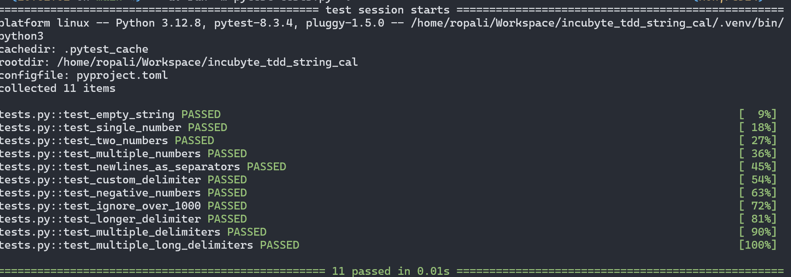

# String Calculator Using TDD

A string calculator implementation using Test-Driven Development (TDD) approach.

## Project Structure

```
string-cal-tdd/
├── string_calculator.py  # Main calculator implementation
├── tests.py              # Test suite
├── README.md             # Project documentation
└── pyproject.toml        # Project config file 
```

## Features

- Basic string addition with comma delimiters
- Support for newline as delimiter
- Custom delimiter support
- Multiple delimiter support
- Handling of negative numbers
- Numbers larger than 1000 are ignored

## Test Results


## Requirements

- Python 3.12 or higher
- [uv](https://docs.astral.sh/uv/) package manager 

## Setup

1. Clone the repository:
```sh
git clone string-cal-tdd

cd string-cal-tdd
```

2. Create and activate virtual environment using uv:
```sh
uv venv && source .venv/bin/activate
```

3. Install dependencies using uv:
```sh
uv sync
```

## Running Tests

Execute the test suite using pytest:

```sh
uv run -m pytest tests.py -v
```
OR
```sh
python -m pytest tests.py -v
```


